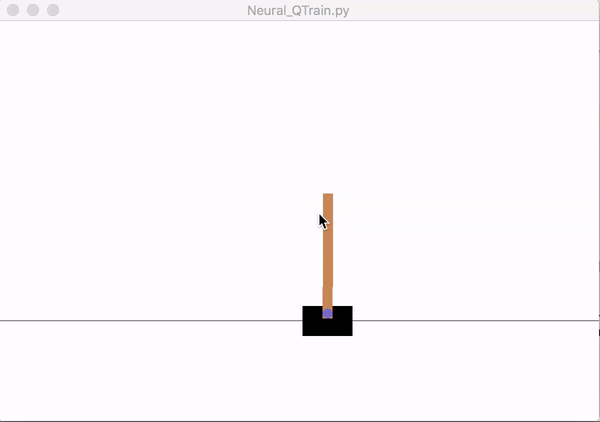

# The assignment 3 for 9444 18s2
## Introdution
In this Project we will implement a Deep Reinforcement Learning algorithm on a classic control task in the OpenAI AI-Gym Environment. Specifically, we will implement Q-Learning using a Neural Network as an approximator for the Q-function.

Because this project are not operating on raw pixel values but already encoded state values, the training time for this assignment is relatively short, and each training run should only require approximately 15 minutes on a standard laptop PC.

### CartPoleV0 (Randomize Agent):

From [OpenAi gym](https://gym.openai.com/envs/CartPole-v1/)

### CartPoleV0 (after 100 iteration through DQN):


## Code Structure
#### Placeholders:
```state_in```: the current state of the environment, which is represented in our case as a sequence of reals.
action_in accepts a one-hot action input. It should be used to "mask" the q-values output tensor and return a q-value for that action.

```target_in```: the Q-value we want to move the network towards producing. Note that this target value is not fixed - this is one of the components that seperates RL from other forms of machine learning.

#### Network Graph:
```q_values```: Tensor containing Q-values for all available actions i.e. if the action space is 8 this will be a rank-1 tensor of length 8

```q_action```: This should be a rank-1 tensor containing 1 element. This value should be the q-value for the action set in the action_in placeholder

#### Main Loop:
Move through the environment collecting experience. In the naive implementation, we take a step and collect the reward. We then re-calcuate the Q-value for the previous state and run an update based on this new Q-value. This is the "target" referred to throughout the code.

## Implementation
#### Experience Replay
To ensure batches are decorrelated, save the experiences gathered by stepping through the environment into an array, then sample from this array at random to create the batch. This should significantly improve the robustness and stability of learning. At this point, we introducd the modified queue so that it can solve the demand for too much computational resources and sample problem from fewer examples.

#### Fix Q target
To accelerate the speed of convergence, we introduced the fix-Q-target algorithm developed from google Deepmind. We define 2 networks which are target net and eval net. we train the eval net every step and fix the target net for constant C steps. After C steps, we assign the weight of target net with eval net.

#### Double DQN

